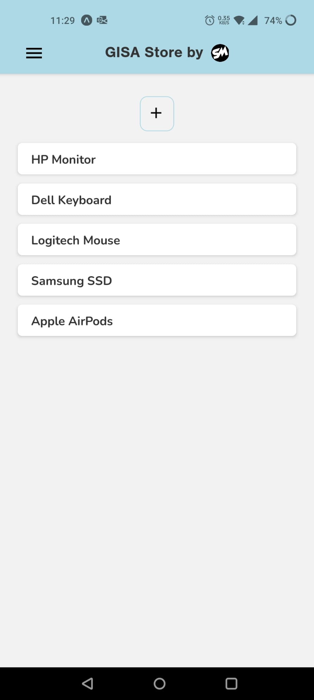
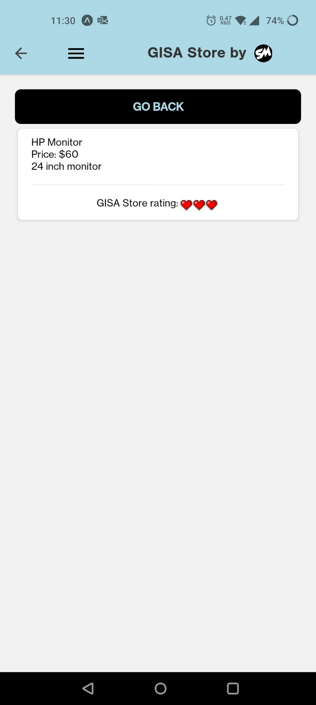
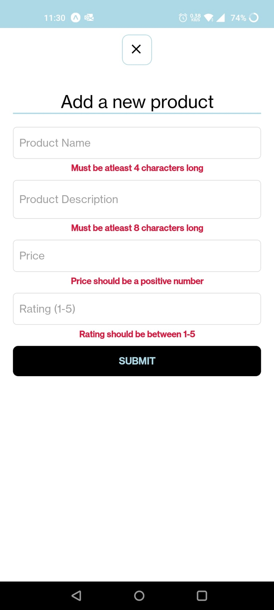
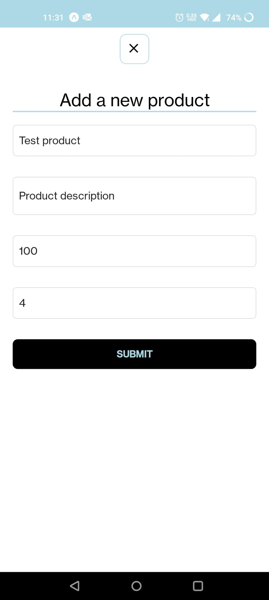
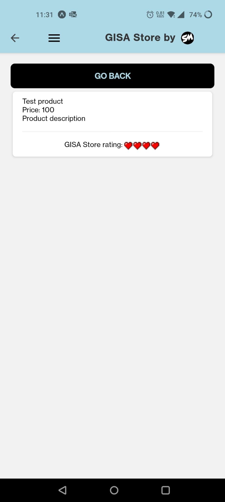

# GISA Store

GISA Store is an online store app built with React Native that allows users to add and post products for buyers to browse and connect with sellers.

## Key Features
- **Product Listings**: Users can add products with details such as name, description, price, and rating.
- **Zod Validation**: Ensures that product details meet specific criteria.
- **User-Friendly Interface**: Easy navigation and clean design.

## Short Description
GISA Store is an online marketplace where users can add products to the store by providing necessary details. Buyers can browse the listed products, view comprehensive information including the product name, description, price, and GISA Store rating, and then connect with the sellers for purchasing. The product form uses Zod validation to ensure data integrity, with constraints such as ratings between 1-5, non-negative prices, product names of at least 4 characters, and descriptions of at least 8 characters.

## Snippets

    <h3>Home Screen and Product Details Screen</h3>
    
    
    

    <h3>Zod Validation and Product Form (Formik)</h3>
    
    
    

## Tech Used
- **React Native**: For building the mobile application.
- **Zod**: For validating product form inputs.
- **JavaScript**: Main programming language for app development.
- **Expo**: For running the React Native project.

Feel free to contribute, raise issues, or suggest features for the continuous improvement of GISA Store.

## How to use
1. Clone the repository: `git clone https://github.com/sarthakmishraa/GISA-store.git`